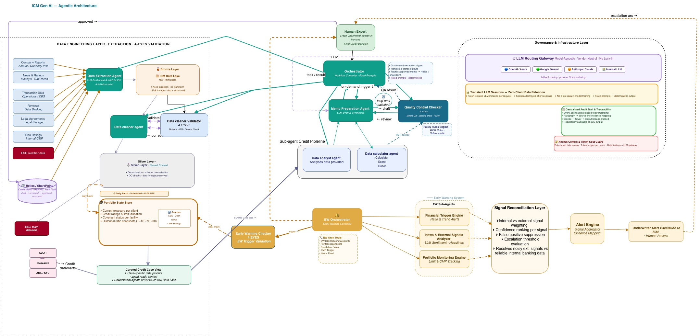
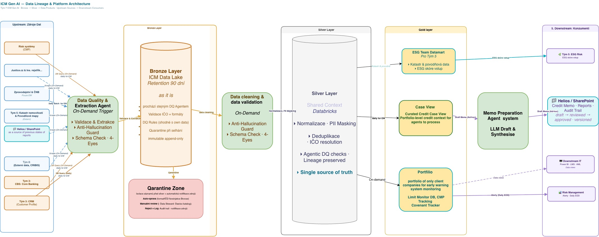

# GenAI pro underwriting — Horizon Bank

**AI-asistovaný systém pro kreditní analýzu a Early Warning**  
LangGraph · Claude / GPT-4o · Streamlit · Databricks Silver

---

## Architektura systému



---

## Data Lineage & Platform Architecture



---

## Analýza: Diagram vs. Skutečná implementace

> Porovnání Data Lineage diagramu (v3) s aktuálním stavem kódu.  
> **Legenda:** ✅ implementováno · ⚠️ částečně / TODO · ❌ není implementováno

### Upstream zdroje

| Zdroj | Diagram | Implementace | Soubor |
|-------|---------|--------------|--------|
| CRIBIS — Tým 8 (finanční data) | ✅ | ✅ | `utils/data_connector.py` · `utils/data_fetcher.py` |
| Justice.cz (výroční zprávy PDF) | ✅ | ✅ fallback | `utils/data_fetcher.py` — cascade krok 2 |
| ARES API (základní údaje) | ✅ | ✅ fallback | `utils/data_fetcher.py` — cascade krok 3 |
| ČNB sazby / zpravodajství | ✅ | ✅ | `utils/news_fetcher.py` |
| Tým 5: Katastr + povodňové mapy | ✅ | ✅ | `utils/data_connector.get_flood_risk()` |
| Risk systémy (CMP) | ✅ | ❌ | Není v `data_connector.py` |
| Helios / SharePoint (předchozí reporty) | ✅ | ❌ | Není implementováno |
| Tým 3: CBS Core Banking | ✅ | ❌ | Není ve Silver schématu |
| Tým 3: CRM (Customer Profile) | ✅ | ❌ | Není ve Silver schématu |

### Bronze Layer — ICM Data Lake

| Funkce | Diagram | Implementace | Poznámka |
|--------|---------|--------------|----------|
| Bronze tier / Data Lake (90 dní "as is") | ✅ | ❌ | **Největší gap.** Kód jde přímo na Silver. Žádná raw vrstva. |
| Data Quality & Extraction Agent (On-Demand) | ✅ | ⚠️ | DQ je v `phase1_extraction.py` na pipeline úrovni, ne na Bronze |
| Validace ICO + formáty | ✅ | ✅ `_norm_ico()` | `utils/data_connector.py` |
| Anti-Hallucination Guard (Bronze) | ✅ | ❌ | Hallucination check je až ve fázi 3 (QC Checker), ne při ingesci |
| Schema Check · 4-Eyes (Bronze) | ✅ | ❌ | 4-Eyes je až Human Review (phase4), ne Bronze |
| **Quarantine Zone** | ✅ | ❌ | **Není implementováno.** Při chybě → `ProcessStatus.FROZEN`, ale bez karantény, auto-opravy ani Data Steward reviewflow |
| Auto-oprava (formát IČO / Bronze) | ✅ | ❌ | Chybí |
| Immutable review (Data Steward) | ✅ | ❌ | Chybí |
| Reject + Log → Audit trail notifikace | ✅ | ⚠️ | Audit trail existuje, ale bez notifikací adminům |

### Silver Layer — Shared Context (Databricks)

| Funkce | Diagram | Implementace | Soubor |
|--------|---------|--------------|--------|
| Normalizace dat | ✅ | ✅ | `utils/data_connector.py` |
| PII Masking | ✅ | ⚠️ | GDPR sanitize je po schválení v `phase4_human_audit.py`, ne při ingesci do Silver |
| Deduplikace | ✅ | ⚠️ | IČO normalizace `_norm_ico()`, ale ne plná deduplikační pipeline |
| ICO resolution | ✅ | ✅ | `_norm_ico()` — strip leading zeros pro CRIBIS JOIN |
| Agentic DQ checks | ✅ | ✅ | `extraction_validator` (phase1) |
| Lineage preserved | ✅ | ✅ | Audit trail s `source_id` v každém uzlu |
| Single source of truth | ✅ | ✅ | Databricks Silver = primární zdroj |

### Gold Layer

| Komponenta | Diagram | Implementace | Soubor |
|------------|---------|--------------|--------|
| **Case View** (Curated Credit Context) | ✅ | ✅ | `CaseView` objekt — `phase2_analysis.py` |
| **Memo Preparation Agent** (LLM Draft) | ✅ | ✅ | `phase3_maker_checker.py` · `maker_skill.yaml` |
| **ESG Team Datamart** (Tým 5) | ✅ | ⚠️ | `esg_pipeline/` hotov; prod INSERT je TODO v `dispatcher.py` |
| **Portfolio** (EWS monitoring) | ✅ | ✅ | `early_warning/` — celá DP2 pipeline |
| Limit Monitor DB | ✅ | ⚠️ | EW_THRESHOLDS existují, ale dedikovaná Limit Monitor DB tabulka není |
| CMP Tracking | ✅ | ❌ | CMP není napojen ani jako upstream |
| Covenant Tracker | ✅ | ⚠️ | `covenant_status` ze Silver `credit_history`, ale ne dedikovaný tracker |

### Downstream konzumenti

| Systém | Diagram | Implementace | Poznámka |
|--------|---------|--------------|----------|
| Helios / SharePoint (Credit Memo) | ✅ | ❌ | **Gap.** Memo je v Streamlit UI, ale žádný export do Helios/SharePoint |
| Risk Management (Daily EWS) | ✅ | ⚠️ | `alert_dispatcher.py` — loguje; prod Delta write je TODO |
| Tým 5: ESG Risk | ✅ | ⚠️ | `esg_pipeline/dispatcher.py` — prod INSERT je TODO |
| Downstream IT (Force P, LMS) | ✅ | ❌ | Není implementováno |
| Audit Trail (versioned) | ✅ | ✅ | `utils/audit.py` — immutable, sha256 hashe |

---

### Shrnutí gapů (prioritizováno)

| Priorita | Gap | Dopad |
|----------|-----|-------|
| 🔴 HIGH | Bronze Layer + Quarantine Zone chybí | Raw data nejsou zachovány 90 dní; při chybě ingesce není karanténní tok |
| 🔴 HIGH | Helios / SharePoint integrace | Credit Memo nedorazí do oficiálního systému banky |
| 🟡 MED | CMP (Risk systémy) + CBS + CRM upstream | Chybí klientský 360° pohled pro underwriting |
| 🟡 MED | PII Masking při ingesci do Silver | GDPR soulad závisí jen na post-approval sanitize |
| 🟡 MED | Prod write: ESG Datamart + EWS Delta | Reálný výstup do konzumentů je TODO |
| 🟢 LOW | Downstream IT (Force P, LMS) | Systémová integrace, není blokující pro hackathon |
| 🟢 LOW | Data Steward review workflow | Operační proces, ne technický blocker |

---

## Přehled

Platforma automatizuje celý životní cyklus kreditní analýzy firemních klientů:

| Oblast | Funkce |
|--------|--------|
| **DP1 — Credit Memo** | 4-fázová LangGraph pipeline: extrakce → analýza → Maker-Checker → Human Review |
| **DP2 — Early Warning** | Automatická detekce rizik v portfoliu, AMBER/RED alerty |
| **ESG Pipeline** | Sběr a transformace ESG dat pro Tým 5 (cross-domain datamart) |
| **Skills Library** | YAML-verzované prompty s sha256 audit hashem, správa přes UI |
| **Audit Trail** | Immutable append-only log každého uzlu (AI i DET) |

---

## Spuštění

```bash
# 1. Závislosti
pip install -r requirements.txt
pip install databricks-sql-connector openai   # pro prod mode

# 2. Konfigurace
cp .env.example .env    # vyplň API klíče

# 3. Demo mode (mock data, bez Databricks)
ICM_ENV=demo streamlit run app.py

# 4. Production mode (reálná Databricks data)
ICM_ENV=production streamlit run app.py
```

---

## Konfigurace (.env)

```env
# Prostředí
ICM_ENV=production          # "demo" | "production"

# LLM
LLM_PROVIDER=anthropic      # "anthropic" | "openai"
LLM_MODEL=claude-opus-4-6   # override modelu (volitelné)
ANTHROPIC_API_KEY=sk-ant-...
OPENAI_API_KEY=sk-proj-...  # pouze pro openai provider

# Databricks — Silver tabulky (naše data)
DATABRICKS_HOST=https://dbc-....cloud.databricks.com
DATABRICKS_TOKEN=dapi...
DATABRICKS_HTTP_PATH=/sql/1.0/warehouses/...
DATABRICKS_CATALOG=vse_banka
DATABRICKS_SCHEMA_SILVER=obsluha_klienta

# CRIBIS — finanční data Tým 8
DATABRICKS_CATALOG_CRIBIS=vse_banka
DATABRICKS_SCHEMA_CRIBIS=investment_banking

# ESG / Flood data
DATABRICKS_SCHEMA_ESG=icm_gen_ai
```

---

## Struktura projektu

```
app.py                              ← Streamlit entry point, navigace
static/
  horizon_logo.png                  ← Horizon Bank logo
  architecture_v5.jpg               ← Diagram architektury

pipeline/                           ← DP1: Credit Memo Pipeline
  state.py                          ← AgentState, ProcessStatus (TypedDict)
  graph.py                          ← LangGraph StateGraph (build_graph, run_pipeline)
  routing.py                        ← Podmíněné hrany (DETERMINISTIC)
  nodes/
    phase1_extraction.py            ← AI: DataExtractorAgent + DET: ExtractionValidator
    phase2_analysis.py              ← DET: ContextBuilder + CreditAnalysisService
    phase3_maker_checker.py         ← AI: MemoPreparationAgent, QualityControlChecker
                                      DET: PolicyRulesEngine (WCR check)
    phase4_human_audit.py           ← DET: HumanReviewNode + RecordHumanDecision + GDPR

early_warning/                      ← DP2: Early Warning System
  graph.py                          ← EWS LangGraph pipeline
  state.py                          ← EWState TypedDict
  nodes/
    portfolio_loader.py             ← DET: načte klienty + CRIBIS enrichment
    metrics_calculator.py           ← DET: utilisation, DPD, overdraft, tax compliance
    anomaly_detector.py             ← DET: pravidla + AI text (recommended_action)
    alert_generator.py              ← DET: sestaví AMBER/RED alerty pro UI
    alert_dispatcher.py             ← DET: dispatch do Risk Management

esg_pipeline/                       ← ESG pro Tým 5 (nesouvisí s Credit Memo)
  collector.py                      ← flood risk, ESG score raw
  transformer.py                    ← AI: ESGTransformerAgent
  dispatcher.py                     ← DET: INSERT do esg_cross_domain_datamart

skills/                             ← YAML skill soubory (LLM prompty)
  __init__.py                       ← SkillsRegistry (load, cache, hash, save, delete)
  extractor_skill.yaml              ← DataExtractor prompt v2.3
  maker_skill.yaml                  ← MemoPreparation prompt v3.2
  checker_skill.yaml                ← QualityControl prompt v2.0
  esg_skill.yaml                    ← ESGAnalysis prompt v1.5
  esg_transformer_skill.yaml        ← ESGTransformer prompt
  ew_analyzer_skill.yaml            ← EWS AI doporučení (recommended_action)
  calculator_skill.yaml             ← Formula library dokumentace (DETERMINISTIC)

utils/
  wcr_rules.py                      ← WCR_LIMITS, WCR_WARNINGS, EW_THRESHOLDS,
                                      check_wcr_breaches(), build_wcr_report()
  calculator.py                     ← compute_all_metrics() — DSCR+CAPEX, leverage atd.
  data_connector.py                 ← Databricks Silver + CRIBIS + flood risk
                                      _norm_ico() — normalizace IČO (strip leading zeros)
  data_fetcher.py                   ← Kaskádový fallback (CRIBIS→Justice.cz→ARES→Freeze)
  news_fetcher.py                   ← EWS signály (ISIR, ČNB sazba, Google News)
  audit.py                          ← _audit() — immutable append-only audit trail
  llm_factory.py                    ← LLMClient model-agnostic (Anthropic / OpenAI)
  mock_data.py                      ← 6 mock klientů + _mock_cribis() + _mock_cribis_prev()
  chunking.py                       ← semantic_chunk() — dělení dokumentů

ui/
  styles.py                         ← CSS, barvy (Manrope, #4D25EB), helper funkce
  page_portfolio.py                 ← Portfolio Dashboard + Early Warning (nahoře)
  page_credit_memo.py               ← Credit Memo Generator + Human Decision panel
  page_human_review.py              ← 4-Eyes Rule Human Review
  page_cases_log.py                 ← Log všech zpracovaných kreditních cases
  page_settings.py                  ← WCR limity · EW prahy · Skills Library
                                      Skills Management (formulář pro nový skill)
                                      Databricks diagnostika + CRIBIS test
  page_audit_trail.py               ← (legacy) Immutable Audit Trail Viewer
  page_early_warning.py             ← (legacy) EWS Dashboard standalone
```

---

## Pipeline DP1 — Credit Memo

```
START
  ↓
[1] DataExtractorAgent (AI)
    · Načte data z Databricks Silver / CRIBIS / fallback (Justice.cz / ARES)
    · Skill: extractor_skill.yaml v2.3
    ↓
[2] ExtractionValidator (DET)
    · Kontroluje confidence_score ≥ 0.85
    · Při selhání → ProcessStatus.FROZEN (NE T-1 fallback)
    ↓
[3] ContextBuilder (DET)
    · Sestaví CaseView z extrahovaných dat
    · Přiřadí source_id každému datovému poli
    ↓
[4] CreditAnalysisService (DET)
    · compute_all_metrics() — DSCR, Leverage, Current Ratio, WCR breaches
    · LLM se matematiky NEDOTÝKÁ
    ↓
[5] MemoPreparationAgent (AI)          ←──────────────┐
    · Generuje Credit Memo                             │ retry (max 3×)
    · Skill: maker_skill.yaml v3.2                     │
    ↓                                                  │
[6] QualityControlChecker (AI)         ───────────────┘
    · Kontroluje citace (≥ 90 % čísel) a halucinace
    · Skill: checker_skill.yaml v2.0
    · freeze | escalate | retry_maker | policy_check
    ↓
[7] PolicyRulesEngine (DET)
    · WCR check: Leverage, DSCR, Utilisation, Current Ratio, DPD
    · None metriky (bez CRIBIS) → skipped ⏭️, ne breach ❌
    ↓
[8] HumanReviewNode (DET)
    · 4-Eyes Rule — čeká na rozhodnutí underwritera
    · ProcessStatus.AWAITING_HUMAN
    ↓
[UI] Human Decision: Approve / Podmínečně / Reject
    · GDPR: po schválení vyčistí raw finanční data ze stavu
    · Audit trail zůstává
```

---

## Pipeline DP2 — Early Warning System

```
START → portfolio_loader → metrics_calculator → anomaly_detector
      → alert_generator → alert_dispatcher → END

Detekované anomálie:
  · Utilisation spike   (≥ 85 % → RED, ≥ 75 % → AMBER)
  · DPD increase        (≥ 30 dní → RED, ≥ 15 dní → AMBER)
  · Revenue drop        (> 20 % MoM → RED, > 10 % → AMBER)
  · Overdraft risk      (≥ 50 % dní v přečerpání → RED)
  · Tax compliance      (< 67 % → AMBER)
  · Covenant breach     (composite risk ≥ 0.7 → RED)
  + News signály:       ISIR insolvence, ČNB sazby, Google News
```

---

## WCR Limity

| Pravidlo | Limit | Zdroj dat |
|----------|-------|-----------|
| Leverage Ratio (Net Debt/EBITDA) | ≤ 5.0x | CRIBIS (Tým 8) |
| DSCR (CAPEX-adjusted proxy) | ≥ 1.2 | CRIBIS (Tým 8) |
| Využití limitu | ≤ 85 % | Silver credit_history |
| Current Ratio (CA/CL) | ≥ 1.2 | CRIBIS (Tým 8) |
| Days Past Due (DPD) | ≤ 30 dní | Silver credit_history |

**Soft limity (WCR_WARNINGS — sledovat, ne breach):**

| Ukazatel | Práh |
|----------|------|
| ICR (EBITDA/Interest) | < 3.0x |
| Debt-to-Equity | > 3.0x |
| Equity Ratio | < 20 % |
| Quick Ratio | < 1.0 |

---

## Datové zdroje

### Silver tabulky (naše team)
```
vse_banka.obsluha_klienta.silver_company_master
  ← IČO jako STRING (může mít vedoucí nuly: '00514152')
vse_banka.obsluha_klienta.silver_corporate_customer
  ← bridge customer_id ↔ IČO (INT)
vse_banka.obsluha_klienta.silver_corporate_financial_profile
  ← SCD Type 2, is_current=TRUE pro aktuální záznam
vse_banka.obsluha_klienta.silver_credit_history
  ← DPD, kovenanty, covenant_status
vse_banka.obsluha_klienta.silver_transactions
  ← 12M měsíční transakce
vse_banka.obsluha_klienta.silver_client_incidents
  ← CRM incidenty 24M
```

### CRIBIS — Tým 8
```
vse_banka.investment_banking.silver_data_cribis_v3
  Klíč: ic (NUMERIC typ)
  
  ⚠️  KRITICKÉ: Silver IČO má vedoucí nuly ('00514152'),
      CRIBIS ic je číslo, CAST(ic AS STRING) = '514152'
      → přímý JOIN selže!
  
  Oprava (data_connector.py):
      WHERE CAST(TRY_CAST(ic AS BIGINT) AS STRING) = '{_norm_ico(ico)}'
      
  Funkce _norm_ico(ico): str(int(ico)) — stripuje vedoucí nuly
  
  Obsahuje: EBITDA, tržby, leverage proxy, current ratio, YoY trendy,
            závazky k úvěrovým institucím, vlastní kapitál, ROA/ROE/ROS
```

### ESG / Flood data
```
vse_banka.icm_gen_ai.silver_ruian_buildings
vse_banka.icm_gen_ai.silver_building_flood_join
  Flood risk podle company_master.city → Q5/Q20/Q100 zóny
```

---

## Skills System

Skills jsou YAML soubory s verzovanými LLM prompty. Každý skill má:
- `sha256[:12]` hash promptu → vždy v audit trail
- `node_type: AI | DETERMINISTIC`
- `version`, `author`, `approved_by`, `approved_at`, `constraints`

### Přidání nového skill (UI)
1. Otevřít **⚙️ Nastavení → ➕ Správa Skills**
2. Vyplnit formulář: klíč, prompt, constraints, data sources
3. Klik **Uložit** → YAML uložen do `skills/`, okamžitě dostupný

### Přidání skill (kód)
```python
from skills import registry

# Uložení nového skill
registry.save_skill("my_team_skill", {
    "name": "My Team Extraction Agent",
    "version": "1.0",
    "author": "my_team",
    "node_type": "AI",
    "prompt": "Jsi extrakční agent pro...",
    "constraints": ["NIKDY nepočítej matematiku"],
})

# Použití
skill = registry.get("my_team_skill")
prompt = skill["prompt"]
ph = registry.get_prompt_hash("my_team_skill")  # pro audit trail
```

---

## Mock Portfolio (demo mode)

| IČO | Název | EW Level | WCR |
|-----|-------|----------|-----|
| 27082440 | Stavební holding Praha a.s. | GREEN | PASS |
| 45274649 | Logistika Morava s.r.o. | RED | FAIL (DSCR + util) |
| 00514152 | Energetika Brno a.s. | GREEN | PASS |
| 26467054 | Retail Group CZ s.r.o. | AMBER | FAIL (util) |
| 63999714 | Farmaceutika Nord a.s. | GREEN | PASS |
| 49551895 | Textil Liberec s.r.o. | RED | FAIL (4 breaches) |

---

## Smoke testy

```bash
python -m utils.calculator
python -m utils.wcr_rules
python -m utils.mock_data
python -m utils.data_connector
python -m utils.data_fetcher
python -m utils.news_fetcher
python -m utils.audit
python -m utils.llm_factory
python -m pipeline.nodes.phase2_analysis
python -m pipeline.nodes.phase3_maker_checker
python -m pipeline.nodes.phase4_human_audit
python -m early_warning.graph
python -m esg_pipeline.dispatcher

# Celá DP1 pipeline (demo mode)
ICM_ENV=demo python -m pipeline.graph 27082440
```

---

## Klíčová pravidla

1. **LLM NIKDY nepočítá matematiku** — veškeré metriky přes `utils/calculator.py`
2. **API failure → ProcessStatus.FROZEN** — nikdy T-1 fallback
3. **Maker-Checker loop** — max 3 iterace, pak ESCALATED
4. **Citation coverage ≥ 90 %** — každé číslo musí mít `[CITATION:source_id]`
5. **Audit trail append-only** — nikdy nepřepisovat existující eventy
6. **GDPR** — raw finanční data vyčištěna po schválení (`_sanitize_transient_data`)
7. **CRIBIS IČO normalizace** — `_norm_ico()` stripuje vedoucí nuly pro JOIN
8. **WCR skipped ≠ breach** — None metrika (bez CRIBIS) = ⏭️, ne ❌

---

## Audit log

| Datum | Událost | Výsledek |
|-------|---------|---------|
| 2026-04-14 | Initial audit (Senior IT Auditor) | 4 PASS, 3 WARNING → opraveno; 0 FAIL |
| 2026-04-15 | CRIBIS leading-zero JOIN bug fix | `_norm_ico()` + `TRY_CAST(ic AS BIGINT)` |
| 2026-04-15 | WCR None-rule rendering fix | skipped ≠ breach; "Nonex" bug fixed |
| 2026-04-15 | Branding → Horizon Bank | logo, "GenAI pro underwriting" |
| 2026-04-15 | Skills Management UI | formulář pro přidání custom skills |
| 2026-04-15 | EWS přesun na vrchol portfolia | viditelnost bez scrollování 400+ klientů |

---

*GenAI pro underwriting v1.0 · Horizon Bank · LangGraph + Claude API · 4-Eyes Rule enforced · Audit Trail: immutable*
